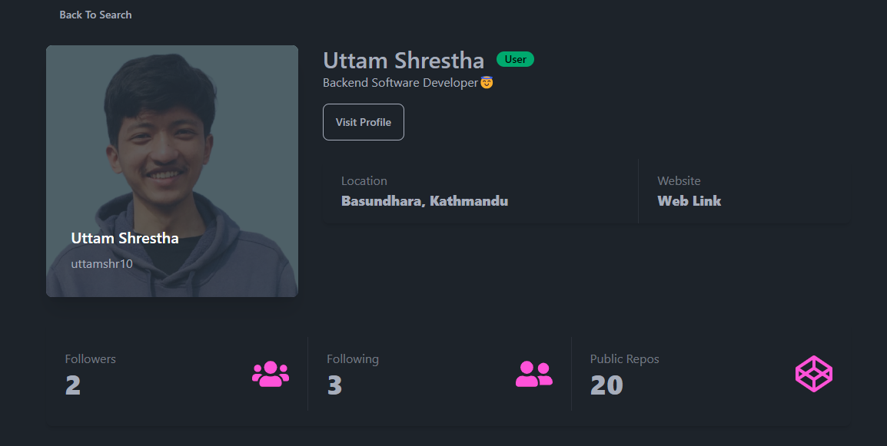
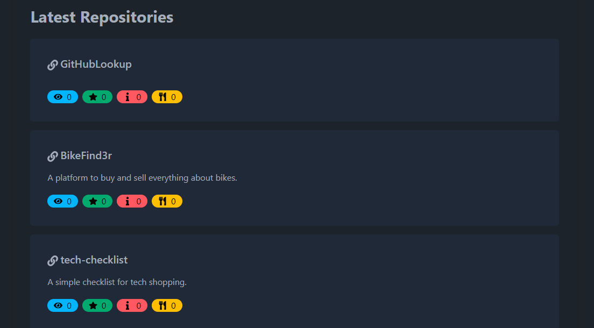

# GitHubLookUp
GitHubLookUp is a React application that allows you to search for GitHub profiles and their latest 10 repositories using the GitHub API. In this project, I learned the concepts of React Components, UseReducer and UseContext.
## Prerequisites
- Text Editor (VS Code)
- Git
- Node.js (version 14 or above)
- npm (version 6 or above)

## Built with
- React
- Vite
- JavaScript
- Tailwind CSS

## Installation

1. Clone the repository to your local machine.
```
git clone git@github.com:uttamshr10/GitHubLookup.git
```

2. Navigate to `cd githublookup`

3. Install the required dependencies. 
```
npm install
```

4. Start the development server.
 ```
 npm run dev
 ```


7. Open your web browser and visit `http://localhost:3000/` to access the URL GitHubLookUp application.

## Usage

1. Enter the GitHub username in the search bar.
2. Click on the show button to fetch and display the user's profile and their latest repositories.

<p align="center"><b>Home Page</b></p>


<p align="center"><b>Search User</b></p>


<p align="center"><b>User Profile</b></p>


<p align="center"><b>Latest Repos</b></p>


# Author
## Uttam Shrestha
[](https://www.linkedin.com/in/uttamshr/)

[](https://github.com/uttamshr10)


# Contributing

Contributions are welcome! If you find any bugs or have any suggestions for improvements, please create an issue or a pull request.

# Contact

If you have any questions or feedback, feel free to contact me at utam.shrestha65@gmail.com
